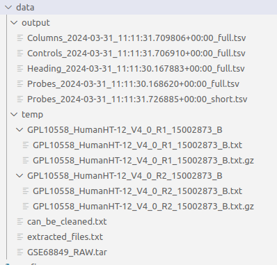
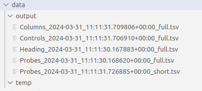

# Data engineering. Homework 1 (HW)

## Installation
```bash
pip install req.txt
```

## Starting pipeline
```bash
python -m pipeline
```

## Folder structure

Base folder structure creating on first startup.

1. **Before** cleanup:



2. **After** cleanup:


